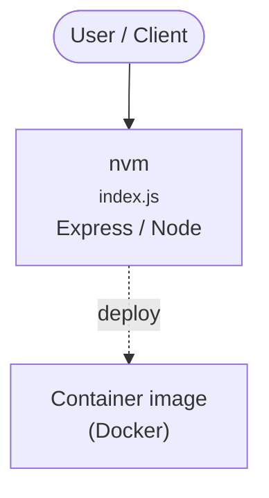

# Context Map — `nvm`

> Auto-generated architecture & deployment context map. Summarizes the core application, container/cloud footprint, and database connections. Regenerate after significant structural changes.

**Repo:** `avnit/nvm` · **Fork** · Public · Primary language: Shell · Default branch: `master` · Files: 334

**Description:** Node Version Manager - Simple bash script to manage multiple active node.js versions

## 1. Core application

Node Version Manager [][3] [][4] :** 32 medium, 8 low
- **Static scan findings:** 9 high

| Severity | Rule | File:Line |
|---|---|---|
| high | curl-pipe-shell | `.github/workflows/windows-npm.yml:42` |
| high | curl-pipe-shell | `.github/workflows/windows-npm.yml:63` |
| high | curl-pipe-shell | `.github/workflows/windows-npm.yml:120` |
| high | curl-pipe-shell | `README.md:104` |
| high | curl-pipe-shell | `README.md:129` |
| high | curl-pipe-shell | `README.md:177` |
| high | curl-pipe-shell | `README.md:811` |
| high | curl-pipe-shell | `README.md:817` |

---
_Generated by repo context-mapping pass on 2026-08-13._